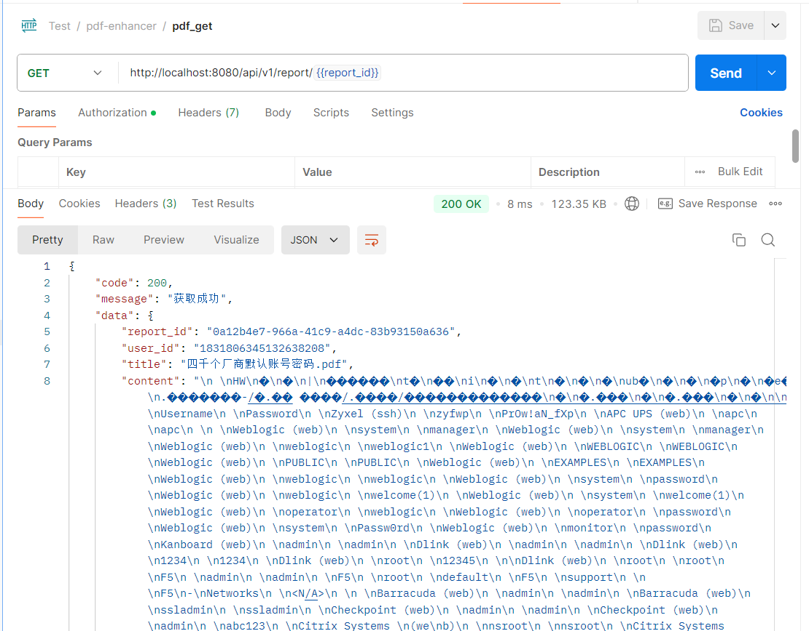

# 后端API接口文档

本文档详细描述了系统的后端API接口，包括用户认证、报告管理和AI摘要生成等功能。

## 1. 用户认证接口

### 1.1 用户注册

- **URL**: `/api/v1/register`
- **方法**: POST
- **描述**: 创建新用户账号
- **请求参数**:

```json
{
  "name": "用户名",      // 必填，2-50个字符
  "email": "用户邮箱",   // 必填，有效的邮箱格式
  "password": "密码"     // 必填，至少8个字符
}
```

- **响应格式**:

```json
{
  "code": 201,
  "message": "注册成功",
  "data": {
    "token": "JWT令牌",
    "user": {
      "user_id": "用户ID",
      "name": "用户名",
      "email": "用户邮箱",
      "created_at": "创建时间",
      "updated_at": "更新时间"
    }
  }
}
```

### 1.2 用户登录

- **URL**: `/api/v1/login`
- **方法**: POST
- **描述**: 用户登录并获取认证令牌
- **请求参数**:

```json
{
  "email": "用户邮箱",   // 必填，有效的邮箱格式
  "password": "密码"     // 必填，至少6个字符
}
```

- **响应格式**:

```json
{
  "code": 200,
  "message": "登录成功",
  "data": {
    "token": "JWT令牌",
    "user": {
      "user_id": "用户ID",
      "name": "用户名",
      "email": "用户邮箱",
      "created_at": "创建时间",
      "updated_at": "更新时间"
    }
  }
}
```

## 2. 报告管理接口

### 2.1 上传报告

- **URL**: `/api/v1/reports/upload`
- **方法**: POST
- **描述**: 上传PDF报告文件
- **请求参数**: 使用`multipart/form-data`格式
  - `file`: PDF文件（必填）
- **认证要求**: 需要JWT令牌
- **响应格式**:

```json
{
  "code": 201,
  "message": "上传成功",
  "data": {
    "report_id": "报告ID",
    "user_id": "用户ID",
    "title": "报告标题",
    "content": "报告内容",
    "summary": "报告摘要",
    "created_at": "创建时间",
    "updated_at": "更新时间",
    "pdf_path": "PDF文件路径"
  }
}
```

### 2.2 获取报告列表

- **URL**: `/api/v1/reports`
- **方法**: GET
- **描述**: 获取当前用户的所有报告列表
- **认证要求**: 需要JWT令牌
- **响应格式**:

```json
{
  "code": 200,
  "message": "获取成功",
  "data": {
    "reports": [
      {
        "report_id": "报告ID",
        "title": "报告标题",
        "created_at": "创建时间",
        "has_summary": "true/false"
      },
      {

      }
    ]
  }
}
```

### 2.3 获取报告详情

- **URL**: `/api/v1/report/:report_id`
- **方法**: GET
- **描述**: 获取指定报告的详细信息
- **URL参数**: 
  - `report_id`: 报告ID（必填）
- **认证要求**: 需要JWT令牌
- **响应格式**:

```json
{
  "code": 200,
  "message": "获取成功",
  "data": {
    "report_id": "报告ID",
    "user_id": "用户ID",
    "title": "报告标题",
    "content": "报告内容",
    "summary": "报告摘要",
    "created_at": "创建时间",
    "updated_at": "更新时间",
    "pdf_path": "PDF文件路径",
    "pdf_url": "PDF文件URL"
  }
}
```


### 2.4 下载报告PDF

- **URL**: `/api/v1/report/:report_id/pdf`
- **方法**: GET
- **描述**: 下载指定报告的PDF文件
- **URL参数**: 
  - `report_id`: 报告ID（必填）
- **认证要求**: 需要JWT令牌
- **响应**: 直接返回PDF文件流，带有以下响应头：
  - `Content-Type`: application/pdf
  - `Content-Disposition`: attachment; filename=文件名
  - `Content-Length`: 文件大小

## 3. AI摘要生成接口

### 3.1 生成报告摘要

- **URL**: `/api/v1/report/:report_id/summary`
- **方法**: POST
- **描述**: 使用AI为指定报告生成摘要
- **URL参数**: 
  - `report_id`: 报告ID（必填）
- **认证要求**: 需要JWT令牌
- **响应格式**:

```json
{
  "code": 200,
  "message": "摘要生成成功",
  "data": {
    "summary": "生成的摘要内容"
  }
}
```

## 4. 错误响应

所有API在发生错误时都会返回统一格式的错误响应：

```json
{
  "code": 错误码,
  "message": "错误描述",
  "data": 错误详情（可选）
}
```

常见错误码：
- 400: 请求参数错误
- 401: 未授权（未登录或令牌无效）
- 403: 禁止访问（权限不足）
- 404: 资源不存在
- 500: 服务器内部错误

## 5. 认证机制

系统使用JWT（JSON Web Token）进行认证。客户端在登录或注册成功后获取令牌，之后的请求需要在HTTP头部添加：

```
Authorization: Bearer <token>
```

令牌有效期为24小时，过期后需要重新登录获取新令牌。